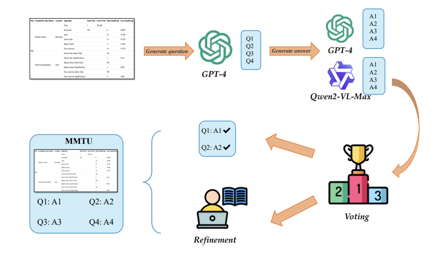
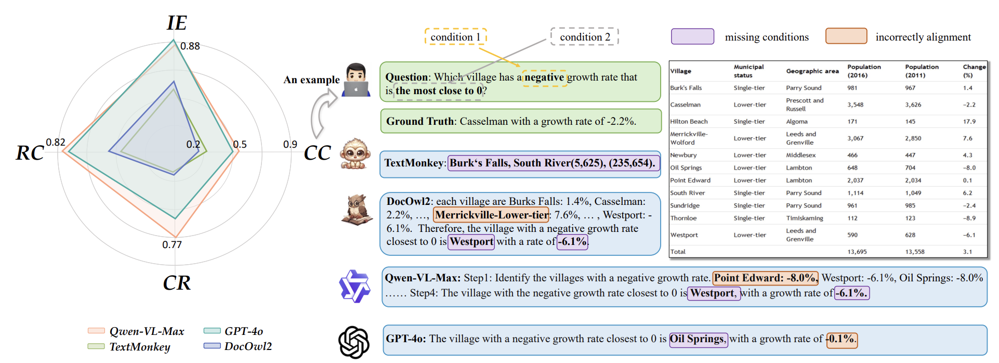
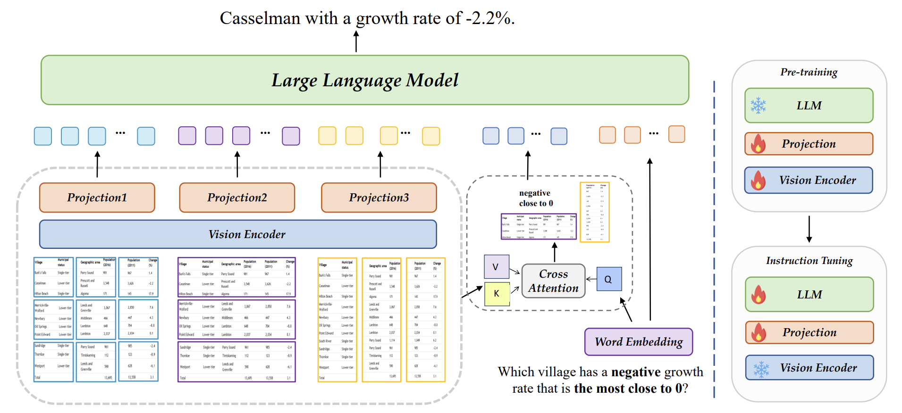

# 🧮 Compositional Condition Question Answering in Tabular Understanding

## 📚 Citation

Our paper has been accepted to **ICML 2025**. If you find our work useful, please cite:

```bibtex
@inproceedings{jiang2025compositional,
  title={Compositional Condition Question Answering in Tabular Understanding},
  author={Jiang, Jun-Peng and Zhou, Tao and Zhan, De-Chuan and Ye, Han-Jia},
  booktitle={Forty-second International Conference on Machine Learning},
  year={2025}
}
```
## 📖 MMTU
<table>
<tr>
<td style="width:60%">
  
In this repository, we introduce **MMTU**, which is Massive Multimodal Tabular Understanding Benchmark.  
We classify the questions into 4 categories:

- **Understanding individual elements (IE)**
- **Interpreting rows and columns (RC)**
- **Comprehending compositional conditions (CC)**
- **Performing calculations or reasoning (CR)**

</td>
<td style="width:40%">
  
</td>
</tr>
</table>


<!-- ## 📖 MMTU


In this repository, we introduce **MMTU**, which is Massive Multimodal Tabular Understanding Benchmark.  
We classify the questions into 4 categories: 
- Understanding individual elements (IE)
- Interpreting rows and columns (RC),  
- Comprehending compositional conditions (CC)
- Performing calculations or reasoning (CR).  -->

We collect Tables from WTQ, TabFact and NAT-QA creating four QA task types across over ten domains and yielding 8921 QA pairs. To ensure quality, GPT-4 generated questions, LLMs and human experts validated answers, retaining consistent pairs and resolving discrepancies, as shown in the above figure.The JSON files of questions can be found in the [data](https://github.com/LAMDA-Tabular/MMTU/tree/main/data) folder,  and the images of tables can be found in the [images](https://huggingface.co/datasets/LAMDA-Tabular/MMTU/tree/main) folder.


## 📏 StructuredTables2Images
During the table collection process, we observed a wide variety of table formats, including HTML, CSV, Markdown, and LaTeX. To standardize these into a consistent image format, we provide a unified pipeline that converts tables from these various formats into PNG images. This conversion facilitates downstream processing and evaluation. The implementation can be found in the [StructuredTables2Images](https://github.com/LAMDA-Tabular/MMTU/tree/main/StructuredTables2Images) module.

## 🔧 Continual Fixing

- Some Results and Visulizations are under preparation. 
- We will upload our training and test code soon.

## 🤗 Contact

If there are any questions, please feel free to propose new features by opening an issue or contact the author: **Jun-Peng Jiang** ([jiangjp@lamda.nju.edu.cn](mailto:jiangjp@lamda.nju.edu.cn)) and **Tao Zhou** ([zhout@lamda.nju.edu.cn](mailto:zhout@lamda.nju.edu.cn)) and **De-Chuan Zhan** ([zhandc@lamda.nju.edu.cn](mailto:zhandc@lamda.nju.edu.cn))and **Han-Jia Ye** ([yehj@lamda.nju.edu.cn](mailto:yehj@lamda.nju.edu.cn)). Enjoy the benchmark.

<!-- <p align="center">

</p>
<p align="center">

</p> -->